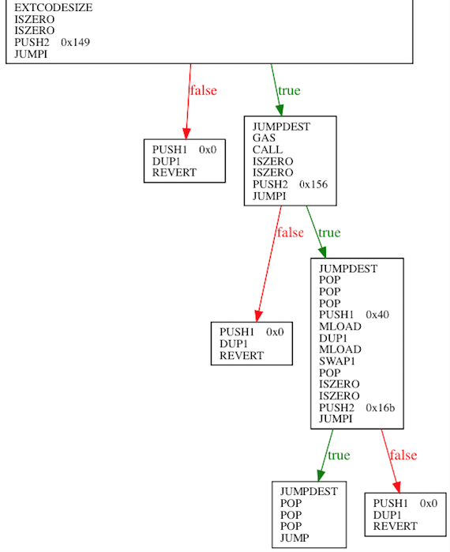

# badERC20Fix  [](https://www.gnu.org/licenses/gpl-3.0) [](https://gitter.im/sec-bit/Lobby) [](http://makeapullrequest.com)

Read the docs in Chinese: https://github.com/sec-bit/badERC20Fix/blob/master/README_CN.md

---

An enormous amount of ERC20 Token contracts do not follow EIP20 strictly [[1]](https://github.com/ethereum/EIPs/blob/master/EIPS/eip-20.md), which undermines DApp developing significantly.

Specially, after Solidity compiler's upgrading to version 0.4.22 on April 17th, compiled Solidity code would become incompatible with a few non-standard smart contracts [[2]](https://github.com/ethereum/solidity/issues/4116), causing difficulties in DApp programming [[3]](https://medium.com/coinmonks/missing-return-value-bug-at-least-130-tokens-affected-d67bf08521ca).

Please refer to SECBIT team's former reports for details [[4]](https://mp.weixin.qq.com/s/1MB-t_yZYsJDTPRazD1zAA)[[5]](https://medium.com/loopring-protocol/an-incompatibility-in-smart-contract-threatening-dapp-ecosystem-72b8ca5db4da). We would introduce this solution in areas of analysis, application scenarios and gas estimation.

## Token Contracts with Return-Value Incompatibility

If you want to get a list of incompatible Token contracts for DApp and DEX developing, please refer to [awesome-buggy-erc20-tokens](https://github.com/sec-bit/awesome-buggy-erc20-tokens) repo.

- [Incompatible transfer()](https://github.com/sec-bit/awesome-buggy-erc20-tokens/blob/master/csv/transfer-no-return_o.csv)
- [Incompatible transferFrom()](https://github.com/sec-bit/awesome-buggy-erc20-tokens/blob/master/csv/transferFrom-no-return_o.csv)
- [Incompatible approve()](https://github.com/sec-bit/awesome-buggy-erc20-tokens/blob/master/csv/approve-no-return_o.csv)

## Code Satisfying ERC20 Specification

```js
contract TokenStd {
    function transfer(address _to, uint256 _value) public returns (bool success) {
        return true;
    }
    function transferFrom(address _from, address _to, uint256 _value) public returns (bool success) {
        return true;
    } 
    function approve(address _spender, uint256 _value) public returns (bool success) {
        return true;
    }
}
```

## Code Unsatisfying ERC20 Specification

```js
// NEVER USE THIS
contract TokenNoStd {
    function transfer(address _to, uint256 _value) public {
    }
    function transferFrom(address _from, address _to, uint256 _value) public {
    }
    function approve(address _spender, uint256 _value) public {
    }
}
```

## Sides Affected

Smart contracts would get affected if they are built in Solidity version >= 0.4.22 and they require calling `transfer()`, `transferFrom()` or `approve()` in other ERC20 Token contracts.

It mainly affects the 2 sides below:

- Decentralized exchanges (DEX)
- DApps using ERC20 Token

## Consequences

- Several non-standard Token contracts are not able to perform transactions normally
- Part of tokens monitored by the contract might get locked forever

It is safe to say that a growing number of ERC20 Token API callings would fail(functions like transfer() would fail in the end due to revert conducted by EVM) as lots of DApps get upgraded.


## Analysis

The incompatibility results partly from not strictly following ERC20 standard, also from the inconsistent behavior in Solidity compiler.

Take a look at the code sample:

```js
pragma solidity ^0.4.18;

interface Token {
    function transfer(address _to, uint256 _value) returns (bool success);
}

contract DApp {
  function doTransfer(address _token, address _to, uint256 _value) public {
    require(Token(_token).transfer(_to, _value));
  }
}
```

This sample calls `transfer()` in the target ERC20 contract and compiles differently in Solidity 0.4.21 and 0.4.22:

### 0.4.21



### 0.4.22


Obviously, the bytecode compiled by 0.4.22 version checks that if RETURNDATASIZE is smaller than 32. The target contract will not pass the test without a return value, thus triggering revert. The solution is bypassing the auto-test on RETURNDATASIZE by compiler and handling manually.

## Solution for DApp and DEX

```js
function isContract(address addr) internal {
    assembly {
        if iszero(extcodesize(addr)) { revert(0, 0) }
    }
}

function handleReturnData() internal returns (bool result) {
    assembly {
        switch returndatasize()
        case 0 { // not a std erc20
            result := 1
        }
        case 32 { // std erc20
            returndatacopy(0, 0, 32)
            result := mload(0)
        }
        default { // anything else, should revert for safety
            revert(0, 0)
        }
    }
}

function asmTransfer(address _erc20Addr, address _to, uint256 _value) internal returns (bool result) {
    // Must be a contract addr first!
    isContract(_erc20Addr);  
    // call return false when something wrong
    require(_erc20Addr.call(bytes4(keccak256("transfer(address,uint256)")), _to, _value));
    // handle returndata
    return handleReturnData();
}
```

One approach is to apply `call()` to invoke `transfer()` and check by getting `returndatasize()` with inline assembly code manually.

- Getting 0 means that the called ERC20 contract transfers successfully without a return value.

- Getting 32 means that the contract meets with ERC20 standard. Please directly call `returndatacopy()` and get the return value for test by `mload()`.

- Else call `revert`.

`returndatacopy()` copies 0-32 Byte in RETURNDATA to 0-32 Byte in memory for `mload()` getting the return value afterwards.

```ruby
memory[destOffset:destOffset+length] = RETURNDATA[offset:offset+length]
```

The full middle layer code needs to support `transferFrom()` and `approve()`. Please refer to [badERC20Fix.sol](badERC20Fix.sol) for details. Forking for test and discussion is also welcomed.

Aside from this, solutions by Lukas Cremer [[6]](https://gist.github.com/lukas-berlin/0f7005301f29e3881ad15449e68c2486#file-gistfile1-txt) and BrendanChou [[7]](https://gist.github.com/BrendanChou/88a2eeb80947ff00bcf58ffdafeaeb61) employs non-standard `function transfer(address to, uint value) external` interface for function calling.

We suggest not to follow this pattern, as the community is supposed to promote interfacing meeting with ERC20 standard.

## Application Scenarios

DApp and DEX developers using Solidity 0.4.22 and above should load the encapsulated ERC20AsmFn Library in the repo and apply to the standard ERC20 contract (`using ERC20AsmFn for ERC20`).

Substitue `asmTransfer()`, `asmTransferFrom()` and `asmApprove()` for `transfer()`, `transferFrom()`, `approve()` when it comes to calling an ERC20 Token contract.

Please handle return values in functions above accordingly.

Each `transfer()` by `asmTransfer()` calling consumes 244 more gas than before by our computation. We can actually optimize further by calling directly with the parsed function signature.

```js
require(_erc20Addr.call(bytes4(keccak256("transfer(address,uint256)")), _to, _value));
```

can change to

```js
require(_erc20Addr.call(0xa9059cbb, _to, _value));
```

Thus the excessive gas cost would reduce from **244** to **96**.

SECBIT team would keep an eye on this ERC20 incompatibility and offer solutions with top security and efficiency continuously. We welcome further discussions to build a better open-source security community.

## Reference

- [1] EIP20 Specification, https://github.com/ethereum/EIPs/blob/master/EIPS/eip-20.md

- [2] Relevant Solidity Issues, https://github.com/ethereum/solidity/issues/4116

- [3] Report by Lukas Cremer, https://medium.com/coinmonks/missing-return-value-bug-at-least-130-tokens-affected-d67bf08521ca

- [4] Report about incompatible Token contracts by SECBIT team, https://mp.weixin.qq.com/s/1MB-t_yZYsJDTPRazD1zAA

- [5] An Incompatibility in Ethereum Smart Contract Threatening dApp Ecosystem, https://medium.com/loopring-protocol/an-incompatibility-in-smart-contract-threatening-dapp-ecosystem-72b8ca5db4da

- [6] Solution by Lukas Cremer, https://gist.github.com/lukas-berlin/0f7005301f29e3881ad15449e68c2486#file-gistfile1-txt

- [7] Solution by BrendanChou, https://gist.github.com/BrendanChou/88a2eeb80947ff00bcf58ffdafeaeb61

## License

[GNU General Public License v3.0](https://www.gnu.org/licenses/gpl-3.0.en.html)
